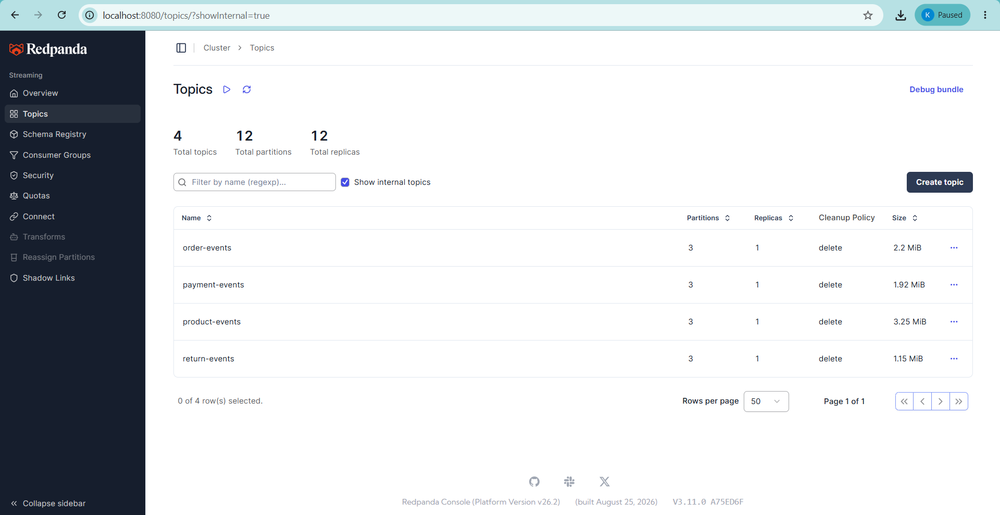
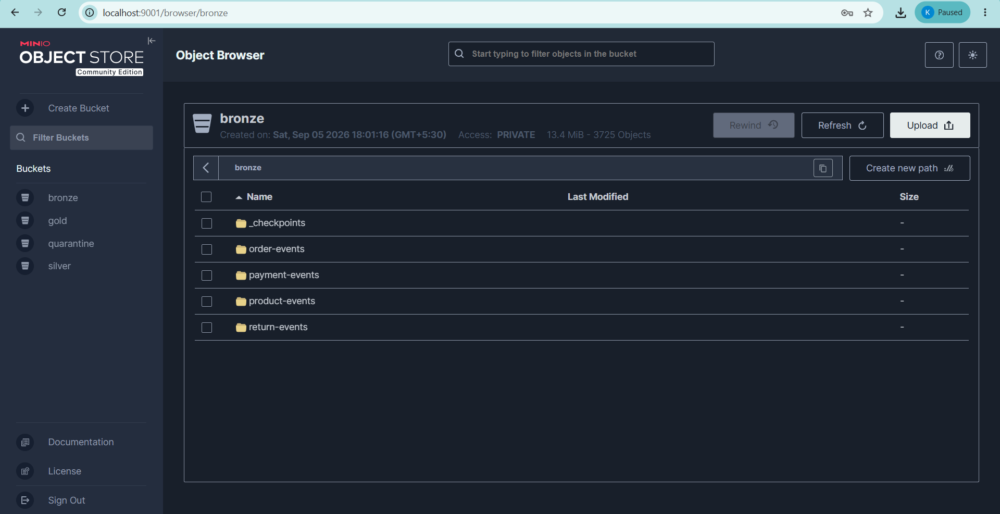
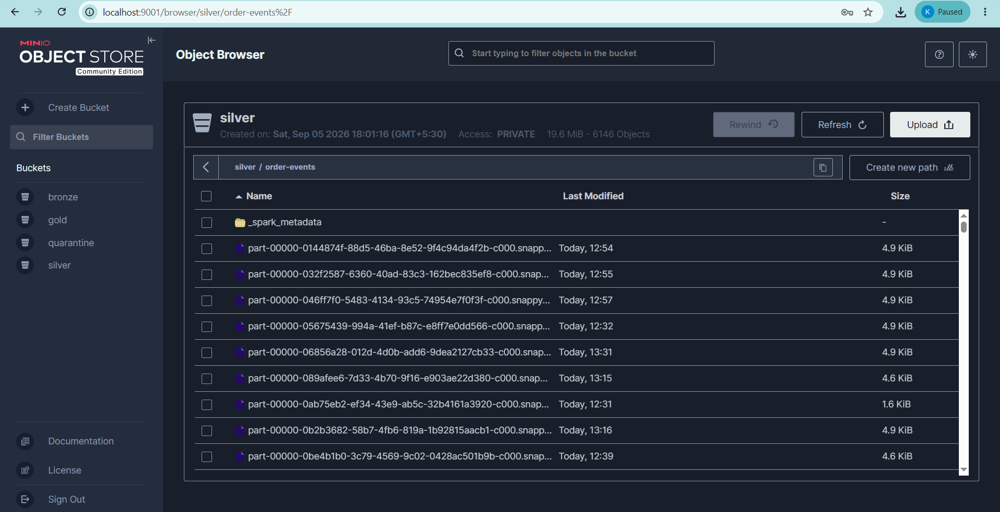
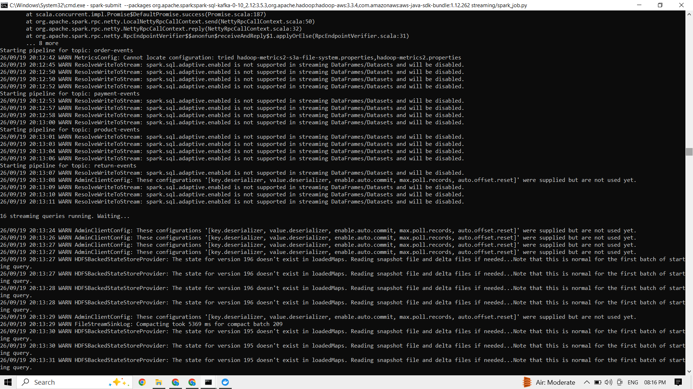
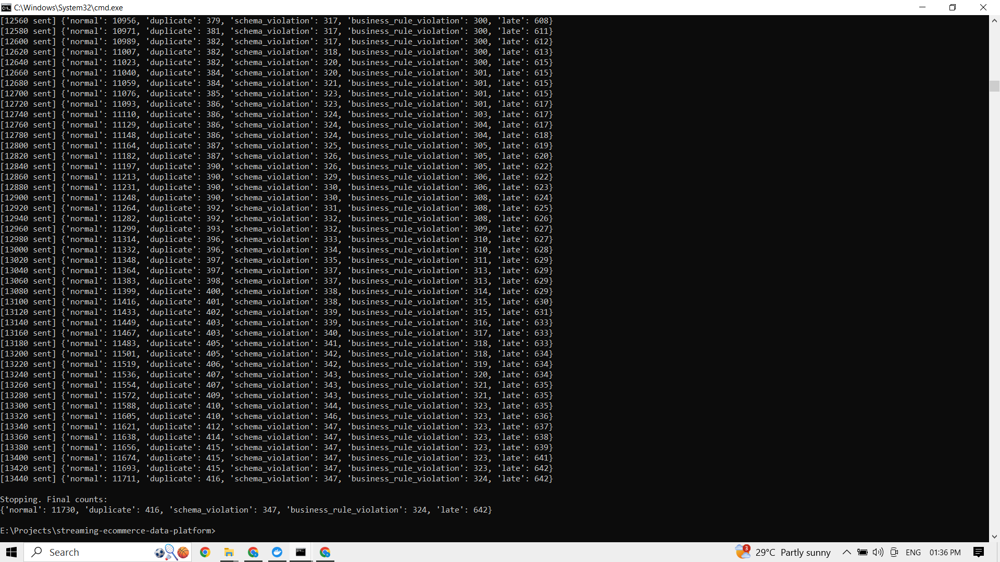

# Real-Time Streaming E-Commerce Data Platform

A local, fully open-source streaming data pipeline that ingests simulated e-commerce events, validates and deduplicates them in real time, and lands them in a Bronze/Silver/Gold data lake — built to demonstrate production-style streaming data engineering, not a toy batch pipeline.

Everything runs locally via Docker — Redpanda (Kafka-compatible), Spark Structured Streaming, MinIO (S3-compatible storage), and DuckDB.

---

## Architecture

```
Python Event Generator
        │
        ▼
     Redpanda  (order-events, payment-events, product-events, return-events)
        │
        ▼
Spark Structured Streaming
        │
        ├──► Bronze (raw JSON + Kafka metadata, written before parsing)
        │
        ▼
   Parse + Schema/Business-Rule Validation
        │
   ┌────┴────┐
   ▼         ▼
Invalid    Valid
   │         │
   ▼         ├──► Silver dedup (10-min watermark) ──► Silver (Parquet, MinIO)
Quarantine   │
(Parquet,    └──► Gold dedup (7-day watermark) ──► Gold windowed aggregates
 MinIO)                                              (Parquet, MinIO)

DuckDB reads Gold Parquet directly off MinIO — no separate load step.
```

**Why two separate watermarks for Silver and Gold:** Spark computes one global watermark per event-time column *within a single query plan*. Silver and Gold are independent streaming queries (separate `writeStream().start()` calls), so each gets its own watermark safely — a tight 10-minute one bounds Silver's dedup state store, while a generous 7-day one on Gold ensures a `product_returned` event arriving days late still gets aggregated instead of dropped.

---

## Tech Stack

| Layer | Technology |
|---|---|
| Event producer | Python |
| Message broker | Redpanda (Kafka-compatible) |
| Stream processing | PySpark Structured Streaming |
| Object storage | MinIO (S3-compatible) |
| Storage format | Parquet |
| Analytics query | DuckDB (reads Gold Parquet directly) |
| Containerization | Docker Compose |

---

## What This Demonstrates

- **Streaming ingestion** — Kafka-style topics, partitioning by `order_id`/`product_id`, producer/consumer patterns
- **Schema validation** — required-field and type checks, driven per-row by event type
- **Business-rule validation** — semantic checks (negative amounts, invalid statuses) distinct from schema checks
- **Quarantine, not silent drop** — every invalid record is preserved with its original JSON payload and failure reason, partitioned by status and date
- **Deduplication** — exactly-once semantics via `event_id`, verified: duplicate events appearing 2x in Bronze collapse to 1x in Silver
- **Watermarking / late-event handling** — events arriving up to 7 days late (realistic for return events) are still processed, not dropped
- **Checkpointing / restart recovery** — verified by killing the Spark job mid-run and restarting; zero reprocessing, zero data loss
- **Bronze/Silver/Gold medallion architecture** — raw fidelity preserved, then progressively cleaned and aggregated

---

## Data Model

Four event types, each independently schema-locked:

- `order_created` — order placement events
- `payment_completed` — payment lifecycle events, linked via `order_id`
- `product_viewed` / `stock_updated` — catalog/inventory events (shared topic)
- `product_returned` — return events, linked via `order_id` and `product_id`; deliberately the most likely to arrive late, matching real-world return behavior

## Fault Injection (Producer)

The event generator deliberately injects controlled "bad" data so the pipeline has something real to catch:

| Category | Rate | Purpose |
|---|---|---|
| Normal | ~87% | Baseline valid traffic |
| Duplicate | ~3% | Tests deduplication |
| Schema violation | ~2.5% | Null/missing required field, wrong type |
| Business-rule violation | ~2.5% | Negative amount, invalid status, etc. |
| Late event | ~5% | Tests watermarking (biased toward `product_returned`) |

---

## Running It

**Prerequisites:** Docker Desktop, Python 3.10+, Java 11, PySpark 3.5.3

```bash
# 1. Start infrastructure
docker compose up -d

# 2. Start the event producer (separate terminal)
python -m producer.event_generator

# 3. Start the Spark pipeline (separate terminal)
spark-submit --packages org.apache.spark:spark-sql-kafka-0-10_2.12:3.5.3,org.apache.hadoop:hadoop-aws:3.3.4,com.amazonaws:aws-java-sdk-bundle:1.12.262 streaming/spark_job.py
```

MinIO Console: `http://localhost:9001` (minioadmin / minioadmin123)
Redpanda Console: `http://localhost:8080`

## Verification Scripts

One-off scripts (in `scripts/`) used to prove each pipeline guarantee, not part of the core architecture:

- `verify_duckdb_minio.py` — confirms the MinIO → Parquet → DuckDB read path
- `verify_dedup.py` — confirms duplicate `event_id`s collapse from Bronze to Silver
- `verify_watermark.py` — confirms late events survive into Silver rather than being dropped
- `verify_restart_recovery.py` — confirms no reprocessing occurs after a crash + restart

---

## Project Scope

This is intentionally scoped in two phases. **Phase 1–2 (this repo, fully complete) is the required deliverable**: infrastructure, streaming ingestion, validation, quarantine, deduplication, watermarking, and checkpointing.

Everything beyond that — DuckDB-backed natural-language analytics via a local LLM, Airflow batch orchestration, a Streamlit dashboard — is explicitly out of scope for v1 and treated as optional future work, not a gap in this deliverable.

---

## Screenshots

**Redpanda topics** — 4 topics, 3 partitions each, as designed:


**MinIO buckets** — Bronze/Silver/Gold/quarantine, populated with real data:


**Silver detail** — actual Parquet part-files landing in `silver/order-events/`:


**Spark pipeline running** — all 4 topics started, 16 streaming queries active:


**Producer fault injection** — live counts across all 5 categories (normal, duplicate, schema violation, business-rule violation, late):

